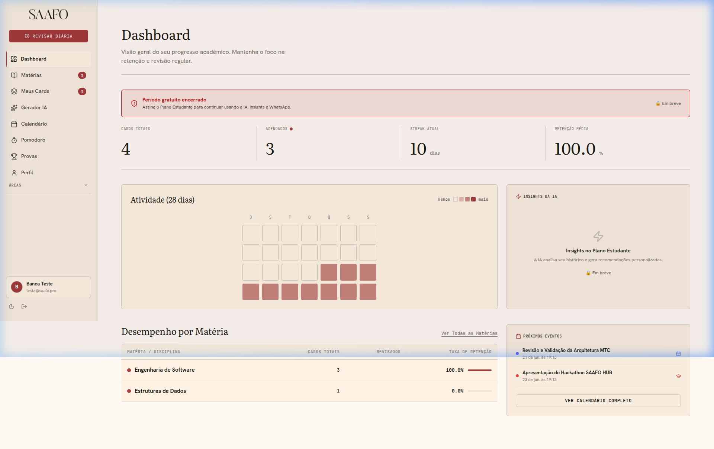
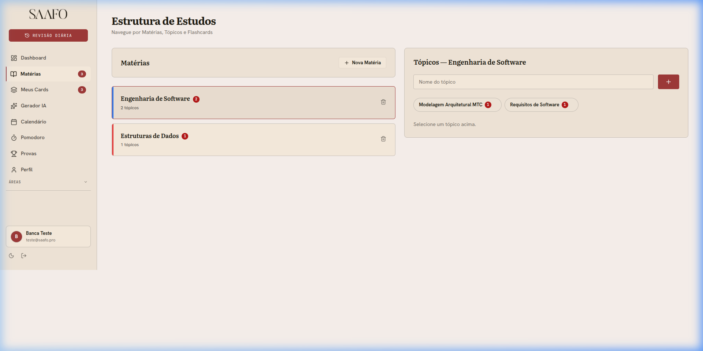
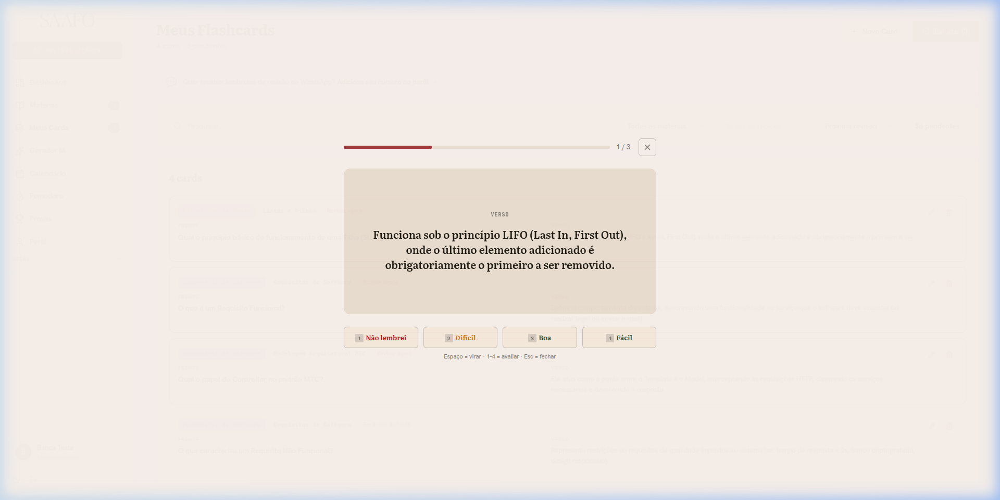
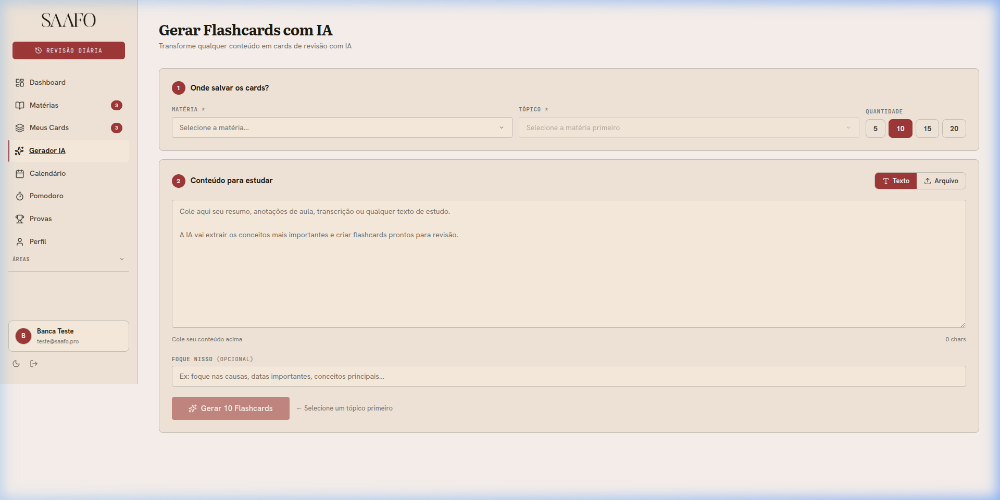
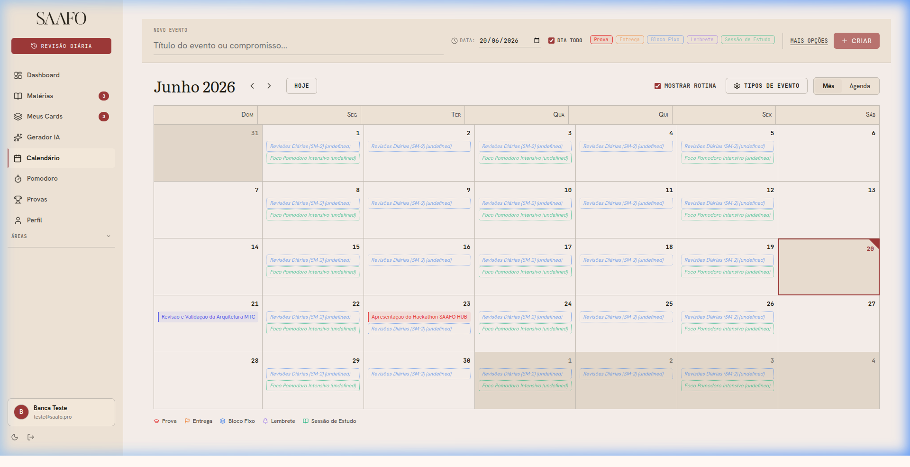

# SAAFO HUB - Sistema de Suporte aos Estudos

O SAAFO HUB é uma plataforma integrada de suporte acadêmico desenvolvida para otimizar o aprendizado, a retenção de conhecimento a longo prazo e a produtividade de estudantes de tecnologia e demais áreas acadêmicas. O sistema reúne gerenciamento de tempo, agendamento de tarefas e consolidação de conteúdo por meio do método de memorização ativa e repetição espaçada baseada em Inteligência Artificial.

---

## 1. Identificação da Equipe e Categoria

*   **Nome da Equipe:** Front-Enzos
*   **Turma:** 3º Período de Análise e Desenvolvimento de Sistemas (ADS) - IFRO (Instituto Federal de Rondônia)
*   **Categoria do Hackathon:** Desafio Livre de Impacto Regional

### Integrantes da Equipe
1.  **João Paulo da Costa de Lima**
    *   **Matrícula:** `2025105100003`
    *   **E-mail:** costa.j@estudante.ifro.edu.br
2.  **Igor Malher da Costa**
    *   **Matrícula:** `2025105100022`
    *   **E-mail:** i.malher@estudante.ifro.edu.br
3.  **Ruan Jhefferson Moura Galdino**
    *   **Matrícula:** `2025105100017`
    *   **E-mail:** ruan.galdino@estudante.ifro.edu.br
4.  **Paulo Cesar da Silva Marrane**
    *   **Matrícula:** `2025105100015`
    *   **E-mail:** paulo.marrane@estudante.ifro.edu.br

---

## 2. Contextualização do Problema

Estudantes de graduação, vestibulandos e concurseiros frequentemente enfrentam desorganização de rotina, sobrecarga de tarefas e baixa retenção de conhecimento a médio e longo prazo. Os métodos de estudo tradicionais passivos (como releituras e resumos) sofrem forte impacto da Curva de Esquecimento de Ebbinghaus. Além disso, o uso fragmentado de diversas ferramentas (timers, calendários, aplicativos de flashcards) gera quebras de foco, procrastinação e ansiedade no período de exames acadêmicos.

---

## 3. Descrição da Solução

O SAAFO HUB unifica e potencializa o ambiente de estudo em uma plataforma intuitiva e de alta performance:
1.  **Memorização Ativa e Repetição Espaçada:** Implementação do algoritmo SuperMemo-2 (SM-2) para agendar automaticamente as revisões de flashcards baseando-se no feedback de facilidade fornecido pelo usuário.
2.  **Geração Assistida por IA (Google Gemini Pro):** Criação automática de flashcards a partir de anotações de texto ou arquivos anexados (PDFs e imagens), diminuindo o esforço de preparação de material.
3.  **Simulador de Provas por IA:** Geração de exames simulados sob medida em múltiplos formatos, inclusive discursivo, fornecendo nota automática e avaliação crítica detalhada das respostas do aluno.
4.  **Calendário e Lembretes Integrados:** Centralização de compromissos acadêmicos com envio automatizado de lembretes via WhatsApp (Evolution API v3) e e-mail.
5.  **Foco Contextualizado:** Timer Pomodoro integrado com sonorização ambiente selecionável para apoiar o foco nas sessões de estudo.

---

## 4. Protótipo em Produção (MVP) e Instruções de Acesso

A aplicação encontra-se implantada em ambiente de produção e está totalmente operacional:

*   **Link de Acesso (Frontend):** [https://saafo.tiezar.pro](https://saafo.tiezar.pro)
*   **Link da API (Backend):** [https://saafo-api.tiezar.pro](https://saafo-api.tiezar.pro)

### Instruções para Avaliação do Sistema

Para avaliar o MVP sem a necessidade de instalação local, siga os passos abaixo:

1.  **Acesso ao portal:** Entre no link do frontend: [https://saafo.tiezar.pro](https://saafo.tiezar.pro).
2.  **Credenciais de Acesso:**
    *   Cadastre uma nova conta clicando em **Registrar** ou faça login de forma rápida usando o botão **Google OAuth**.
    *   Alternativamente, utilize a credencial de teste homologada no banco de dados:
        *   **Usuário de Teste:** `teste@saafo.pro`
        *   **Senha:** `SaafoTeste123`
3.  **Criação de Matéria e Tópicos:**
    *   No menu lateral, clique em **Materiais**.
    *   Crie uma nova matéria (Ex: "Engenharia de Software") e selecione uma cor de identificação.
    *   Dentro da matéria criada, adicione um tópico de estudo (Ex: "Requisitos de Software").
4.  **Geração de Flashcards por IA:**
    *   Navegue até a seção de **Gerador de IA**.
    *   Selecione o tópico criado e digite um texto de resumo de aula ou faça o upload de um arquivo PDF/Imagem (até 50MB).
    *   Clique em **Gerar por IA** para que a inteligência artificial formule a lista estruturada de cartões de estudo (frente/verso).
5.  **Modo de Revisão (SM-2):**
    *   Inicie uma sessão de estudos. O reprodutor será aberto em tela cheia com os cartões ativos.
    *   Leia a pergunta, mentalize a resposta e pressione a **Barra de Espaço** (ou clique na tela) para revelar o verso.
    *   Classifique seu grau de memorização de 0 a 5 clicando nos botões ou usando os atalhos numéricos do teclado (`1` a `5`). O algoritmo SM-2 recalculará a próxima data de revisão.
6.  **Simulação de Prova:**
    *   Na página de simulados, escolha a quantidade de questões e o tipo de prova (Ex: Dissertativa) baseado na matéria criada.
    *   Responda às questões e clique em enviar para receber o feedback detalhado da IA com notas e justificativas.
7.  **Agendamento no Calendário e Timer:**
    *   Acesse o **Calendário** para agendar um compromisso e configure o disparo de alertas por e-mail ou WhatsApp.
    *   Utilize o widget lateral do **Timer Pomodoro** durante seus estudos para registrar ciclos de foco e pausas cronometradas.

---

## 5. Tecnologias Utilizadas

### Backend (REST API)
*   **Framework:** NestJS (Node.js) com TypeScript.
*   **ORM de Persistência:** Prisma ORM.
*   **Banco de Dados:** PostgreSQL 16.
*   **Autenticação:** JSON Web Token (JWT) e Google OAuth 2.0.
*   **Processamento de IA:** Google Gemini API (modelo Gemini Pro).
*   **Integrações de Disparo:** Evolution API v3 (WhatsApp) e Resend (E-mail).
*   **Gateway de Pagamento:** Asaas API (Faturamento e controle de assinaturas).

### Frontend (SPA)
*   **Framework/Biblioteca:** React (Vite) com TypeScript.
*   **Gerenciador de Rotas:** React Router DOM.
*   **Estilização Visual:** Vanilla CSS customizado, orientado a design tokens semânticos flexíveis e acessibilidade (atalhos de teclado estruturados).

---

## 6. Estrutura do Repositório

O projeto adota uma estrutura monorepo simplificada e organizada:

```
saafo-hub/
├── backend/            # API REST (NestJS, Prisma, Services, Tests)
│   ├── prisma/         # Esquema do banco de dados e migrações
│   ├── src/            # Lógica principal de negócios, entidades e controllers
│   └── test/           # Suíte de testes unitários e de integração
├── frontend/           # Interface SPA (React, Vite, CSS, Components)
│   ├── public/         # Recursos estáticos de mídia
│   └── src/            # Telas, rotas, lógica de contexto e hooks React
├── docs/               # Relatórios e especificações de Engenharia de Software
├── docker-compose.yml  # Configuração de containers locais (PostgreSQL)
├── .gitignore          # Filtro de arquivos ignorados pelo Git
└── README.md           # Apresentação técnica oficial (este arquivo)
```

---

## 7. Instalação e Execução Local

### Pré-requisitos
*   Node.js (v18 ou superior)
*   Docker & Docker Compose (para banco de dados PostgreSQL local)

### Configuração e Execução do Backend
1.  Navegue até a pasta: `cd backend`
2.  Instale as dependências: `npm install`
3.  Crie um arquivo `.env` a partir de `.env.example` e preencha as credenciais.
4.  Inicie o banco PostgreSQL local: `docker-compose up -d` (no diretório raiz)
5.  Execute as migrations do banco: `npx prisma migrate dev`
6.  Inicie o servidor de desenvolvimento: `npm run start:dev`

### Configuração e Execução do Frontend
1.  Navegue até a pasta: `cd frontend`
2.  Instale as dependências: `npm install`
3.  Crie um arquivo `.env` a partir de `.env.example` configurando a URL da API (`VITE_API_URL="http://localhost:3000"`).
4.  Inicie a aplicação: `npm run dev`
5.  Acesse `http://localhost:5173` no seu navegador.

---

## 8. Evidências de Validação e Testes

A estabilidade e eficiência do SAAFO HUB foram avaliadas sob quatro frentes estruturadas:

1.  **Testes de Unidade (Jest):** Cobertura e verificação das regras matemáticas do algoritmo SM-2, do cálculo de trial, permissões de planos e geradores de faturamento no backend.
2.  **Testes de Integração e E2E:** Simulações completas de fluxos (cadastro, upload de arquivo para IA, processamento de JSON, agendamento de revisões e geração de logs).
3.  **Ambiente de Homologação (Staging):** Deploy contínuo em VPS secundária para validar webhooks assíncronos do gateway de pagamento (Asaas) e Evolution API (notificações WhatsApp) de forma isolada.
4.  **Testes com Usuários Reais:** Grupo de teste composto por 5 estudantes universitários que utilizaram a plataforma no dia a dia por 4 dias, servindo para refinar atalhos de teclado e ajustar a legibilidade de visualizações do calendário.

### Demonstração Visual do MVP (Telas da Aplicação)

| **Dashboard Principal (Insights & Heatmap)** | **Gerenciador de Matérias & Tópicos** |
|:---:|:---:|
|  |  |

| **Player de Flashcards (Revisão SM-2)** | **Gerador de Conteúdo por IA** |
|:---:|:---:|
|  |  |

| **Calendário Acadêmico & Rotina Semanal** |
|:---:|
|  |

Para rodar a suíte de testes locais do backend, utilize:
```bash
cd backend
npm run test          # Testes unitários
npm run test:e2e      # Testes de ponta a ponta
npm run test:cov      # Relatório de cobertura
```

---

## 9. Declaração de Uso de Inteligência Artificial

*   **Ferramentas utilizadas:** Anthropic Claude e Google Gemini (via assistentes de codificação com IA)
*   **Finalidade:** Apoio no desenvolvimento acelerado e deploy do MVP, materializando na íntegra as regras de negócio e a visão do produto propostas no projeto original do grupo.
*   **Partes do projeto apoiadas por IA:**
    *   *Aceleração do Deploy e Configurações:* Auxílio na configuração de ambientes, depuração de builds, automação da infraestrutura com Docker/Coolify e conexões seguras.
    *   *Implementação de Recursos:* Desenvolvimento ágil de funcionalidades críticas como o player de flashcards com atalhos físicos do teclado, editor visual de rotinas integradas no calendário e interface de simulador de provas.
    *   *Documentação e Organização:* Formatação das especificações técnicas e mapeamento conceitual da solução sob o padrão arquitetural MTC.
*   **O que a equipe revisou, adaptou ou validou:** A equipe Front-Enzos analisou e validou todas as sugestões geradas, adaptando-as conforme necessário para garantir a integridade do algoritmo SuperMemo-2 (SM-2) de repetição espaçada e a aderência aos requisitos especificados.

---

## 10. Apresentação e Pitch do Projeto

*   **Link dos Slides da Apresentação:** `[Link para os slides de apresentação]`
*   **Link do Vídeo de Pitch (YouTube / Drive):** `[Link para o vídeo de pitch]`

---

## 11. Arquitetura MTC (Exigência da Disciplina de Programação II)

A modelagem de dados e responsabilidades da aplicação se alinha conceitualmente ao padrão **MTC (Model-Template-Controller)**:

*   **Model (Lógica e Persistência):** Classes e schemas que definem os dados de negócio: `User`, `Subject`, `Topic`, `Card` (agendamento SM-2), `CardReview` e `CalendarEvent` (herdados de uma classe abstrata `BaseEntity`).
*   **Template (Views e Telas):** Interfaces visuais em React consumidas pelo usuário: **Dashboard** (heatmap e métricas), **Materials**, **AIGenerator**, **StudySessionOverlay** (com suporte total a atalhos de teclado) e **CalendarPage**.
*   **Controller (Intermediadores REST):** Camada de controllers do NestJS responsável pelo mapeamento das rotas HTTP, tratamento de payload e comunicação direta com os Services (Ex: `/auth/register`, `/cards`, `/study-sessions/review`, `/ai/generate`).

---

*Desenvolvido pela equipe Front-Enzos para a Hackathon IFRO ADS 2026.*
