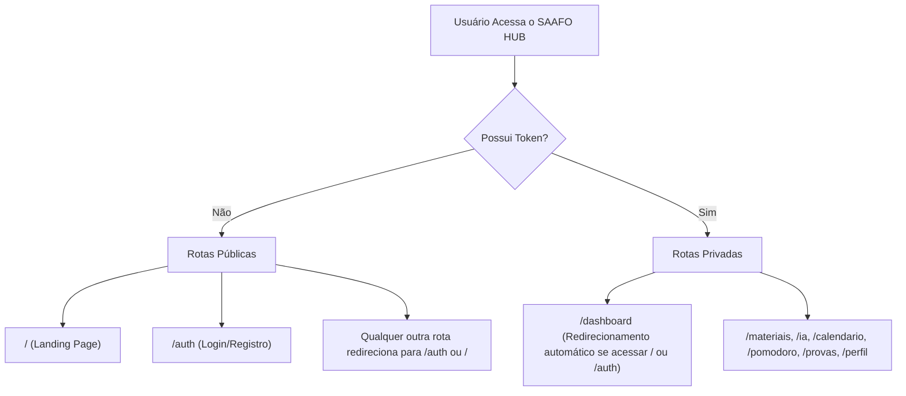

# Design Spec: Landing Page do SAAFO HUB

**Data:** 2026-06-23  
**Status:** Aprovado (Brainstorming)  
**Autor:** Antigravity AI  

---

## 1. Objetivo do Projeto
Desenvolver uma landing page de alta conversão para o SAAFO HUB, focada em atrair estudantes e convertê-los em usuários cadastrados. O design deve respeitar os tokens e padrões visuais do sistema (temas claro/escuro, cores e tipografia), garantindo consistência visual e facilidade de transição para o fluxo de autenticação.

---

## 2. Arquitetura de Rotas e Navegação

O arquivo `App.tsx` será adaptado para tratar de forma separada as páginas públicas e privadas.



### Componente Header (Menu Superior)
* **Logotipo:** Logo oficial da plataforma com preenchimento responsivo ao tema ativo.
* **Menu Central:** Âncoras HTML para rolagem suave:
  * `#funcionalidades` (Recursos)
  * `#como-funciona` (Como Funciona)
  * `#planos` (Preços e Planos)
* **Lado Direito:**
  * Botão de alternar tema (Sol/Lua) utilizando o estado global do `AppContext`.
  * Botão CTA Secundário: `Entrar ou Registrar` (`.btn-secondary`).

---

## 3. Layout e Estrutura de Conteúdo

### 3.1 Hero Section
* **Chamada Principal (H1):** *"Domine seus estudos com Inteligência Artificial e Memorização Ativa"* (Fonte serifada `--font-display`).
* **Subtexto:** *"Crie flashcards automaticamente a partir de PDFs com o Gemini e revise-os no momento exato usando o algoritmo SM-2"* (Fonte `--font-body`).
* **CTA Principal:** Botão `.btn-primary` grande (`.btn-lg`) com a chamada *"Começar Gratuitamente"*, direcionando para `/auth?mode=register`.
* **Demonstração Visual:** Mockup responsivo simulando a interface do player de flashcards do SAAFO HUB.

### 3.2 Funcionalidades (`#funcionalidades`)
Grid de 4 blocos (`.grid-2` do sistema) exibindo os recursos chave:
1. **Inteligência Artificial (Gemini Pro):** Envie PDFs ou imagens para extrair flashcards prontos instantaneamente.
2. **Repetição Espaçada (SM-2):** Algoritmo inteligente que calcula o momento ideal para cada revisão de conteúdo.
3. **Simulador de Provas:** Pratique com exames gerados por IA e receba notas críticas detalhadas.
4. **Foco e Lembretes:** Pomodoro integrado com sonorização ambiente e alertas automáticos via WhatsApp/E-mail.

### 3.3 Como Funciona (`#como-funciona`)
Fluxo linear em 3 etapas simplificadas:
1. **Crie sua conta:** Registro simples em segundos ou via Google OAuth.
2. **Adicione conteúdo:** Faça upload de PDFs acadêmicos ou digite anotações.
3. **Revise inteligentemente:** Receba alertas de estudo e acompanhe o heatmap de produtividade.

### 3.4 Planos e Preços (`#planos`)
Exibição lado a lado de dois cards de planos (`.card` com fundo `var(--bg-card)`):
* **Plano Estudante (Free):** 7 dias de trial para testar todas as funcionalidades de IA.
* **Plano Premium (Pago via Asaas):** Acesso ilimitado à geração por IA, simulados de exames e disparo de WhatsApp.
* *Conversão:* Os botões de seleção de plano direcionam o usuário para `/auth?mode=register` com redirecionamento pós-login.

### 3.5 Rodapé (Footer)
* Créditos à equipe *Front-Enzos* (ADS 3º Período - IFRO 2026).
* Direitos autorais e links de termos legais de uso.

---

## 4. Integração de Tema e Fluxos Técnicos

### Sincronização de Cores
A Landing Page será estilizada com classes puras que apontam para as variáveis nativas do SAAFO:
* Fundo base: `var(--bg-deep)` e `var(--bg-card)`
* Textos: `var(--text-primary)` e `var(--text-muted)`
* Destaques: `var(--color-primary)` (Oxblood no tema claro, Coral no tema escuro)
* Bordas: `var(--border-color)`

### Ajuste no Fluxo de Autenticação (`Auth.tsx`)
Ajustaremos o componente `Auth.tsx` para interceptar parâmetros de URL:
```typescript
const params = new URLSearchParams(window.location.search);
const mode = params.get('mode');
if (mode === 'register') {
  setIsRegistering(true);
}
```

---

## 5. Estratégia de Teste e Validação
1. **Verificação de Responsividade:** Testar o header e o grid de recursos em viewports móveis (~414px) e desktop.
2. **Teste de Fluxo de Conversão:** Validar se os CTAs principais direcionam corretamente para `/auth` com o formulário aberto no modo de registro.
3. **Teste de Persistência de Tema:** Validar que ao trocar o tema na Landing Page, o estado é preservado no `localStorage` e a tela `/auth` ou `/dashboard` carrega com o mesmo tema selecionado.
